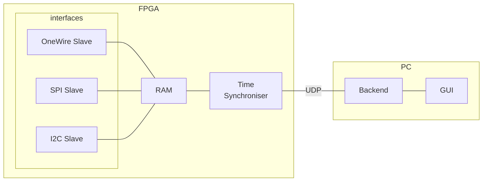

# obscuro
> _hiding your programs from the perils of the real-world_

Obscuro is a Hardware-in-the-Loop environment that allows embedded systems to communicate with what it thinks is actual
sensors, but is really an FPGA-based emulation system. A software platform allows the emulation of the sensors to
be configured and controlled, with new values fed in from the user's simulator.

## Interfaces
- [ ] I2C
- [ ] SPI
- [ ] UART

## Software API
A Rust library provides an interface to submit sensor data to the FPGA.

## Repository Structure
- [hardware](hardware/) - PCB Designs and Interface Documentation
- [firmware](firmware/) - FPGA VHDL
- [software](software/) - Rust Library and GUI

## Architecture

